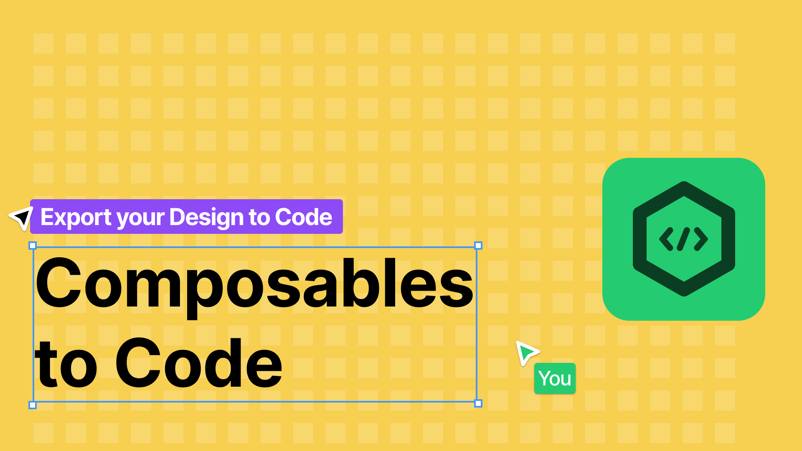

# Unopinionated Compose Export Plugin for Figma

**_Export your Design to Composables_**

Quickly export a node hierarchy as composables with a customizable mapping for your design system.

This plugin isn't focused on generating pixel-perfect code that mirrors everything Figma offers.
Instead, it's designed to save you from the repetitive task of constantly writing `Column`, `Row`, `Text`, ...,
and renaming components or variables to match your design system in code.

### Currently Supported Features

-   solid colors on texts, borders and backgrounds
-   simple texts with one styling
-   `Row`, `Column`, `Box`, `Text`, and `FlowRow` nodes
-   box nodes as a fallback for icons or images
-   baseline alignment of texts
-   `weight(1f)` modifier on child nodes of `Row` or `Column`
-   fixed sizing modifiers
-   mapping of local variables (only paddings)
-   mapping of text and color styles
-   retain the original name of the nodes as a comment

### TODOs

-   gradients for borders and backgrounds
-   borders with patterns
-   borders only on specific sides
-   multi-text layouts (as annotated strings)
-   min & max measurements
-   support for more local variable types, including colors
-   ...

### Bugs or Feature Requests?

You can either open an issue
or write an email to [hey@letsprescribe.company](mailto:hey@letsprescribe.company).
If you encounter any bug, please attach a `*.fig` file as a reference.

Check out the plugin at [Figma](https://www.figma.com/community/plugin/1414536195807409133).
